# LAPORAN TUGAS AKHIR

---

## IDENTITAS NASKAH

| Field | Isi |
|---|---|
| **Judul** | *Rancang Bangun Portal Layanan Warga RT Berbasis Web untuk Kelurahan Inauga, Kabupaten Mimika* |
| **Nama Penulis** | *[NAMA LENGKAP]* |
| **NIM** | *[NIM]* |
| **Program Studi** | *[NAMA PRODI]* |
| **Fakultas / Perguruan Tinggi** | *[NAMA KAMPUS]* |
| **Dosen Pembimbing** | *[NAMA DOSEN]* |
| **Tahun** | 2026 |

> **Catatan:** Ganti placeholder di atas sebelum dicetak. Dokumen teknis ini diperluas dari [`RINGKASAN-SISTEM.md`](RINGKASAN-SISTEM.md). Referensi hukum dan benchmark: [`REFERENSI.md`](REFERENSI.md).

---

## DAFTAR ISI

1. [BAB I — Pendahuluan](#bab-i--pendahuluan)
2. [BAB II — Landasan Teori](#bab-ii--landasan-teori)
3. [BAB III — Analisis dan Perancangan Sistem](#bab-iii--analisis-dan-perancangan-sistem)
4. [BAB IV — Implementasi dan Pengujian](#bab-iv--implementasi-dan-pengujian)
5. [BAB V — Penutup](#bab-v--penutup)
6. [Lampiran](#lampiran)

---

# BAB I — Pendahuluan

## 1.1 Latar Belakang

Administrasi di tingkat Rukun Tetangga (RT) Kelurahan Inauga, Distrik Wania, Kabupaten Mimika, Papua Tengah, masih banyak mengandalkan proses manual. Warga datang ke sekretariat RT untuk mengajukan surat pengantar, menyerahkan fotokopi Kartu Keluarga (KK) dan Kartu Tanda Penduduk (KTP), serta menunggu informasi status permohonan secara lisan atau melalui pesan WhatsApp pribadi pengurus.

Kondisi tersebut menimbulkan beberapa permasalahan operasional:

1. **Antrean dan ketergantungan tatap muka** — layanan surat pengantar RT memerlukan kehadiran fisik warga di sekretariat, sehingga proses menjadi lambat pada jam sibuk.
2. **Data warga tersebar** — arsip berupa formulir fisik, chat WhatsApp, dan berkas kertas sulit dilacak secara terpusat.
3. **Keterbatasan transparansi status** — warga tidak memiliki cara praktis memantau progres permohonan tanpa menghubungi pengurus RT.
4. **Verifikasi identitas rentan kesalahan** — pencocokan data pemohon surat masih bergantung pada pemeriksaan manual.
5. **Kebutuhan panel operasional** — pengurus RT membutuhkan sistem terpusat untuk pendataan, permohonan surat, pengaduan, dan publikasi kegiatan.

Perkembangan e-government di tingkat pemerintah daerah menunjukkan bahwa digitalisasi pelayanan publik dapat meningkatkan efisiensi dan transparansi. Beberapa platform layanan RT/RW nasional — seperti RTRW Online, Ruang Warga, dan SiDakRT — telah memfasilitasi pengajuan surat dan pendataan warga secara daring. Namun, belum semua RT di wilayah Papua Tengah memiliki sistem serupa yang disesuaikan dengan kebutuhan lokal dan infrastruktur setempat.

Berdasarkan permasalahan tersebut, penelitian ini mengembangkan **Portal Layanan Warga RT** (*Layanan Administrasi RT*) — sistem informasi berbasis web yang dapat diakses melalui `https://layananwarga.my.id`. Portal ini memfasilitasi pengajuan layanan administrasi RT secara daring, verifikasi identitas warga, manajemen data kependudukan tingkat RT, pelacakan status permohonan, serta notifikasi pembaruan layanan melalui WhatsApp.

### Tabel 1.1 Perbandingan Benchmark Platform RT/RW

| Aspek | RTRW Online | Ruang Warga | SiDakRT | Portal Layanan Warga RT (sistem ini) |
|---|---|---|---|---|
| **Fokus layanan** | Surat RT/RW, pendataan | Layanan warga digital | Data & administrasi RT | Surat pengantar, pendataan, pengaduan, publikasi |
| **Login warga** | Diperlukan | Diperlukan | Diperlukan | **Tidak wajib** untuk layanan utama |
| **Verifikasi identitas** | Akun + data RT | Akun terdaftar | Data RT | NIK + RT + HP (surat); selfie wajah (pendataan baru) |
| **Notifikasi** | Bervariasi | Bervariasi | Bervariasi | WhatsApp teks via WAHA (bukan PDF) |
| **Surat output** | Digital / cetak | Digital | Bervariasi | **Cetak manual** di sekretariat RT; portal catat nomor surat |
| **Integrasi Dukcapil** | Tidak langsung | Tidak langsung | Tidak langsung | Tidak (fase 1, mandiri) |
| **Biaya warga** | Gratis / bervariasi | Gratis | Bervariasi | **Gratis** — tanpa OTP pembayaran |

---

## 1.2 Rumusan Masalah

Berdasarkan latar belakang di atas, rumusan masalah penelitian adalah:

1. Bagaimana merancang portal layanan administrasi RT berbasis web yang memfasilitasi pengajuan dan pelacakan permohonan surat pengantar?
2. Bagaimana mengimplementasikan modul pendataan warga beserta lampiran dokumen identitas (KK, KTP/KIA)?
3. Bagaimana melakukan verifikasi identitas pemohon secara terarah (NIK/RT/HP untuk surat; verifikasi wajah untuk pendataan warga baru)?
4. Bagaimana mendukung pengurus RT dalam memproses permohonan, mengelola data warga, dan mengirim notifikasi status melalui WhatsApp?

---

## 1.3 Tujuan

### Tujuan Umum

Membangun portal layanan warga RT berbasis web yang dapat diakses melalui browser untuk Kelurahan Inauga, Kabupaten Mimika.

### Tujuan Khusus

1. Mengimplementasikan modul permohonan surat pengantar RT dengan verifikasi identitas NIK, RT, dan nomor HP.
2. Mengimplementasikan modul pendataan warga baru dan pendataan ulang beserta unggah dokumen identitas.
3. Mengintegrasikan verifikasi wajah berbasis browser (face-api.js) pada alur pendataan warga baru.
4. Menyediakan halaman pelacakan status permohonan tanpa login warga.
5. Mengintegrasikan notifikasi teks WhatsApp otomatis via WAHA pada perubahan status layanan.
6. Menyediakan panel operasional pengurus RT untuk verifikasi, pencatatan nomor surat manual, dan manajemen data warga.
7. Menyediakan panel admin sistem untuk konfigurasi pengguna, profil RT, dan katalog layanan.

---

## 1.4 Manfaat

### Manfaat Teoritis

1. Menyediakan referensi implementasi sistem informasi e-government tingkat RT/RW dengan stack open source (Laravel, Docker, WAHA).
2. Mendokumentasikan pola verifikasi identitas tanpa registrasi akun warga — alternatif aksesibilitas layanan publik digital.
3. Menjadi studi kasus integrasi notifikasi WhatsApp pada alur pelayanan administrasi pemerintahan desa/kelurahan.

### Manfaat Praktis

| Pihak | Manfaat |
|---|---|
| **Warga** | Mengajukan surat, pendataan, dan pengaduan online tanpa login; lacak status via nomor permohonan; terima notifikasi WhatsApp |
| **Pengurus RT** | Panel terpusat untuk verifikasi pendataan, proses permohonan, kelola data warga, publikasi kegiatan, dan log notifikasi |
| **Admin sistem** | Manajemen akun pengurus, profil RT, katalog layanan, dan persetujuan penghapusan data permanen |

---

## 1.5 Batasan Masalah

1. Sistem ini **bukan** layanan resmi Dukcapil dan **tidak** menerbitkan KK, KTP, SKTM, atau akta resmi.
2. Surat pengantar RT **dicetak manual** di sekretariat RT; portal hanya mencatat nomor surat dan mengirim notifikasi teks — **bukan** generator atau pengirim PDF surat.
3. Notifikasi WhatsApp (WAHA) hanya berupa **pesan teks**; bukan pengiriman berkas PDF via WhatsApp.
4. Verifikasi wajah (face-api.js) hanya diterapkan pada **pendataan warga baru**, bukan formulir surat pengantar publik.
5. Tidak ada integrasi langsung ke database Dukcapil/SIAK (kebijakan fase 1).
6. Tidak ada pembayaran online, OTP pembayaran, kartu kredit, PIN bank, atau transaksi finansial — layanan **gratis**.
7. Wilayah implementasi difokuskan pada Kelurahan Inauga, Kabupaten Mimika, Papua Tengah.

---

## 1.6 Sistematika Penulisan

Laporan tugas akhir ini disusun dalam lima bab dan lampiran:

- **BAB I — Pendahuluan:** latar belakang, rumusan masalah, tujuan, manfaat, batasan, dan sistematika penulisan.
- **BAB II — Landasan Teori:** e-government, sistem informasi, administrasi kependudukan, metodologi pengembangan, teknologi, penelitian terkait, dan kerangka konseptual.
- **BAB III — Analisis dan Perancangan Sistem:** analisis kebutuhan, use case, activity diagram, DFD, ERD, perancangan antarmuka, arsitektur, dan keamanan.
- **BAB IV — Implementasi dan Pengujian:** lingkungan pengembangan, struktur proyek, implementasi modul, screenshot UI, metode pengujian, dan hasil pengujian.
- **BAB V — Penutup:** kesimpulan dan saran.
- **Lampiran:** diagram lengkap, dictionary data, template WhatsApp, manual pengguna, dan log pengujian.

---

# BAB II — Landasan Teori

## 2.1 E-Government tingkat RT/RW

E-government (*electronic government*) adalah pemanfaatan teknologi informasi dan komunikasi (TIK) oleh instansi pemerintah untuk meningkatkan efisiensi, transparansi, dan kualitas pelayanan publik (Heeks, 2006). Pada tingkat RT/RW — unit administrasi terkecil di Indonesia — digitalisasi layanan mencakup pendataan warga, pengajuan surat pengantar, dan komunikasi dengan masyarakat.

Manfaat e-government tingkat RT/RW:

1. **Aksesibilitas** — warga dapat mengakses layanan tanpa harus selalu datang ke sekretariat.
2. **Transparansi** — status permohonan dapat dilacak secara real-time.
3. **Efisiensi operasional** — pengurus RT memiliki arsip digital terpusat.
4. **Akuntabilitas** — log notifikasi dan histori permohonan tercatat di sistem.

Portal Layanan Warga RT termasuk kategori *information system* + *e-government* tingkat RT, bukan substitusi layanan Dukcapil resmi.

---

## 2.2 Sistem Informasi

Sistem informasi (SI) adalah kombinasi terorganisir dari manusia, perangkat keras, perangkat lunak, jaringan komunikasi, dan sumber daya data yang mengumpulkan, mengubah, dan menyebarkan informasi dalam suatu organisasi (Laudon & Laudon, 2020).

Komponen SI yang relevan dengan portal ini:

| Komponen | Implementasi |
|---|---|
| **Input** | Formulir permohonan surat, pendataan warga, pengaduan; unggah KK/KTP; selfie wajah |
| **Proses** | Verifikasi identitas, validasi berkas, workflow status permohonan, ekstraksi descriptor wajah |
| **Output** | Status permohonan, notifikasi WhatsApp, laporan PDF data warga, publikasi kegiatan |
| **Feedback** | Halaman Lacak, log notifikasi, panel pengurus RT |
| **Penyimpanan** | MySQL (data relasional), `storage/app/private` (berkas sensitif) |

---

## 2.3 Administrasi Kependudukan tingkat RT

Administrasi kependudukan di Indonesia diatur oleh:

| Peraturan | Keterangan |
|---|---|
| **UU No. 23 Tahun 2006** | Administrasi Kependudukan — kewajiban pencatatan penduduk |
| **PP No. 40 Tahun 2019** | Perubahan atas PP 37/2007 tentang Pelaksanaan UU Adminduk |
| **Permendagri No. 95/2019** | Standar teknis SIAK (Sistem Informasi Administrasi Kependudukan) |
| **Permendagri No. 138/2017** | Pedoman PTSP (Pelayanan Terpadu Satu Pintu) |

Peran RT dalam administrasi kependudukan meliputi pendataan warga, penerbitan **surat pengantar** (bukan dokumen resmi), dan koordinasi dengan kelurahan/Dukcapil. Field wajib surat pengantar RT/RW: nama, tempat/tanggal lahir, jenis kelamin, status perkawinan, kewarganegaraan, NIK/KK, agama, pekerjaan, alamat, keperluan — ditandatangani Ketua RT dan RW.

Portal ini **memfasilitasi** permohonan surat pengantar dan pendataan warga di tingkat RT, bukan menerbitkan dokumen kependudukan resmi.

---

## 2.4 Metodologi Pengembangan

Penelitian ini menggunakan metodologi **Prototype** dengan pendekatan iteratif:

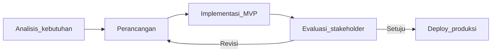

**Justifikasi pemilihan Prototype:**

1. Stakeholder utama (pengurus RT Kelurahan Inauga) dapat memberikan feedback langsung pada setiap iterasi.
2. Kebutuhan fase 1 dapat dirilis cepat sebagai MVP (Minimum Viable Product) tanpa menunggu integrasi Dukcapil.
3. Fitur dapat ditambahkan bertahap (fase 2: integrasi SIAK, aplikasi mobile).

Tahapan pengembangan:

| Tahap | Aktivitas | Output |
|---|---|---|
| 1 | Observasi & wawancara pengurus RT | Daftar kebutuhan fungsional |
| 2 | Perancangan use case, ERD, wireframe | Dokumen desain |
| 3 | Implementasi backend Laravel + frontend Blade/Vite | Kode aplikasi |
| 4 | Integrasi WAHA & face-api.js | Modul notifikasi & verifikasi wajah |
| 5 | Deploy Docker Compose di VPS | `layananwarga.my.id` |
| 6 | Pengujian PHPUnit + black-box | Laporan pengujian |

> **Placeholder:** Cantumkan tanggal observasi/wawancara di Kelurahan Inauga jika diminta penguji.

---

## 2.5 Teknologi yang Digunakan

### Backend

| Teknologi | Versi | Fungsi |
|---|---|---|
| PHP | 8.4 | Runtime server-side |
| Laravel | 13.x | Framework MVC, routing, ORM, queue |
| MySQL | latest | Database relasional produksi |
| Laravel Queue | database driver | Antrian notifikasi asinkron |
| DomPDF | 3.x | Laporan PDF data warga RT |

### Frontend

| Teknologi | Versi | Fungsi |
|---|---|---|
| Blade | — | Template engine server-side rendering |
| Vite | 8.x | Build tool asset frontend |
| Tailwind CSS | 4.x | Utility-first CSS framework |
| Vanilla JavaScript | ES modules | Form pendataan, verifikasi wajah, tabel data |
| face-api.js | 1.7.x | Deteksi & verifikasi wajah di browser |
| TensorFlow.js | 4.x | Backend ML untuk face-api |

### Infrastruktur & Integrasi

| Teknologi | Fungsi |
|---|---|
| Docker Compose | Orkestrasi container (app, nginx, mysql, queue, waha) |
| Nginx | Reverse proxy + SSL (Let's Encrypt) |
| WAHA | WhatsApp HTTP API untuk notifikasi teks |
| ImageMagick + Node.js | Ekstraksi descriptor wajah dari scan KTP/KK (server-side) |

**Justifikasi Laravel:** framework MVC mature, ekosistem PHP luas di pemerintahan daerah, dokumentasi lengkap, dan integrasi native dengan queue, migration, dan testing.

**Justifikasi Docker:** memudahkan replikasi deployment di server VPS atau lingkungan RT/Kelurahan lain dengan konfigurasi konsisten.

---

## 2.6 Penelitian Terkait

### Platform benchmark nasional

| Platform | URL | Kelebihan | Keterbatasan relatif |
|---|---|---|---|
| RTRW Online | rtrwonline.id | Ekosistem layanan RT/RW | Generik, tidak spesifik Mimika |
| Ruang Warga | ruangwarga.id | Portal layanan warga terintegrasi | Wajib login warga |
| SiDakRT | sidakrt.com | Fokus data administrasi RT | Fitur notifikasi WA bervariasi |

### Pola layanan pemerintah daerah

- **Dukcapil DKI Jakarta** — portal layanan kependudukan online tingkat provinsi.
- **BAPENDA Jabar** — chatbot WhatsApp untuk permohonan informasi.
- **Imigrasi Banggai** — notifikasi status permohonan via WhatsApp.

### Kontribusi diferensial sistem ini

1. Akses warga **tanpa registrasi akun** untuk layanan utama.
2. Verifikasi wajah AI di browser khusus pendataan warga baru.
3. Kebijakan fase 1: surat fisik manual + notifikasi WA teks (bukan PDF).
4. Deploy containerized siap produksi di `layananwarga.my.id`.

---

## 2.7 Kerangka Konseptual

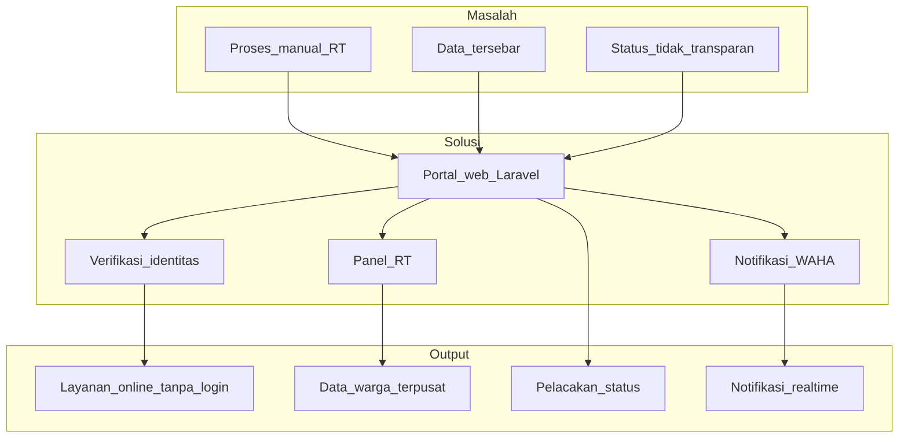

---

# BAB III — Analisis dan Perancangan Sistem

## 3.1 Analisis Kebutuhan

### 3.1.1 Analisis Situasi Awal

*[Placeholder: ringkasan hasil observasi/wawancara di sekretariat RT Kelurahan Inauga — jumlah RT, volume permohonan surat per bulan, kendala operasional.]*

Situasi awal yang diidentifikasi dari analisis kebutuhan dan kebijakan proyek:

- Pengajuan surat pengantar dilakukan secara manual di sekretariat RT.
- Data warga tersimpan dalam berkas fisik dan komunikasi WhatsApp informal.
- Warga tidak memiliki nomor permohonan terstandar untuk pelacakan status.
- Pengurus RT membutuhkan sistem terpusat untuk verifikasi pendataan dan permohonan.

### 3.1.2 Kebutuhan Fungsional

| ID | Kebutuhan | Aktor | Prioritas |
|---|---|---|---|
| F01 | Mengajukan permohonan surat pengantar RT | Warga | Tinggi |
| F02 | Verifikasi identitas NIK + RT + HP sebelum ajukan surat | Warga | Tinggi |
| F03 | Mengajukan pendataan warga baru dengan unggah KK/KTP | Warga | Tinggi |
| F04 | Verifikasi wajah selfie kepala keluarga (pendataan baru) | Warga | Tinggi |
| F05 | Mengajukan pendataan ulang data keluarga terdaftar | Warga | Tinggi |
| F06 | Melacak status permohonan via nomor permohonan | Warga | Tinggi |
| F07 | Mengirim pengaduan/laporan ke pengurus RT | Warga | Sedang |
| F08 | Melihat kegiatan dan pengumuman RT | Warga | Sedang |
| F09 | Verifikasi/setujui/tolak pengajuan pendataan | Pengurus RT | Tinggi |
| F10 | Memproses permohonan surat, catat nomor surat manual | Pengurus RT | Tinggi |
| F11 | Kelola data warga (KK, anggota, lampiran dokumen) | Pengurus RT | Tinggi |
| F12 | Kelola pengaduan warga, update status | Pengurus RT | Sedang |
| F13 | CRUD kegiatan & pengumuman, broadcast WhatsApp | Pengurus RT | Sedang |
| F14 | Manajemen pengguna, profil RT, katalog layanan | Admin | Tinggi |
| F15 | Kirim notifikasi teks WhatsApp otomatis | Sistem | Tinggi |

### 3.1.3 Kebutuhan Non-Fungsional

| ID | Kebutuhan | Keterangan |
|---|---|---|
| NF01 | Keamanan | HTTPS, CSP, RBAC, berkas privat |
| NF02 | Kinerja | Halaman publik responsif; queue untuk notifikasi WA |
| NF03 | Ketersediaan | Deploy Docker dengan health check `/up` |
| NF04 | Usability | Portal tanpa login; antarmuka Bahasa Indonesia |
| NF05 | Skalabilitas | Multi-RT via `RtProfile`; siap replikasi Docker |
| NF06 | Privasi | KK/KTP disimpan di `storage/app/private` |
| NF07 | Portabilitas | Containerized; PHP 8.4 + MySQL |

---

## 3.2 Use Case Diagram

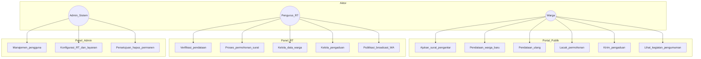

---

## 3.3 Deskripsi Use Case Utama

### UC-01: Ajukan Surat Pengantar RT

| Field | Keterangan |
|---|---|
| **Aktor** | Warga (sudah terdata) |
| **Precondition** | NIK terdaftar di RT; data demografi lengkap |
| **Alur utama** | 1) Pilih jenis surat → 2) Verifikasi NIK+RT+HP → 3) Isi keperluan & unggah KK/KTP → 4) Sistem buat permohonan status *Diajukan* → 5) Notifikasi WA |
| **Alur alternatif** | Identitas tidak cocok → tampilkan pesan error |
| **Postcondition** | Permohonan tercatat; pengurus RT dapat memproses |
| **Controller** | `LetterServiceController`, `GuestApplicationController` |

### UC-02: Pendataan Warga Baru

| Field | Keterangan |
|---|---|
| **Aktor** | Warga (keluarga belum terdata) |
| **Precondition** | Memiliki scan KK dan KTP/KIA anggota |
| **Alur utama** | 1) Isi data KK & anggota → 2) Unggah dokumen → 3) Selfie wajah kepala KK → 4) Pilih RT domisili → 5) Menunggu verifikasi RT |
| **Postcondition** | Data KK masuk status menunggu verifikasi |
| **Controller** | `PendataanWargaController` |

### UC-08: Proses Permohonan Surat (RT)

| Field | Keterangan |
|---|---|
| **Aktor** | Ketua RT / Sekretaris RT |
| **Alur utama** | 1) Buka detail permohonan → 2) Periksa berkas → 3) Cetak surat fisik di sekretariat → 4) Catat nomor surat manual → 5) Kirim notifikasi WA *siap diambil* |
| **Alur alternatif** | Berkas kurang → minta lengkap; Tolak → hapus + notifikasi penolakan |
| **Controller** | `Rt\ApplicationController` |

---

## 3.4 Activity Diagram

### 3.4.1 Aktivitas Warga

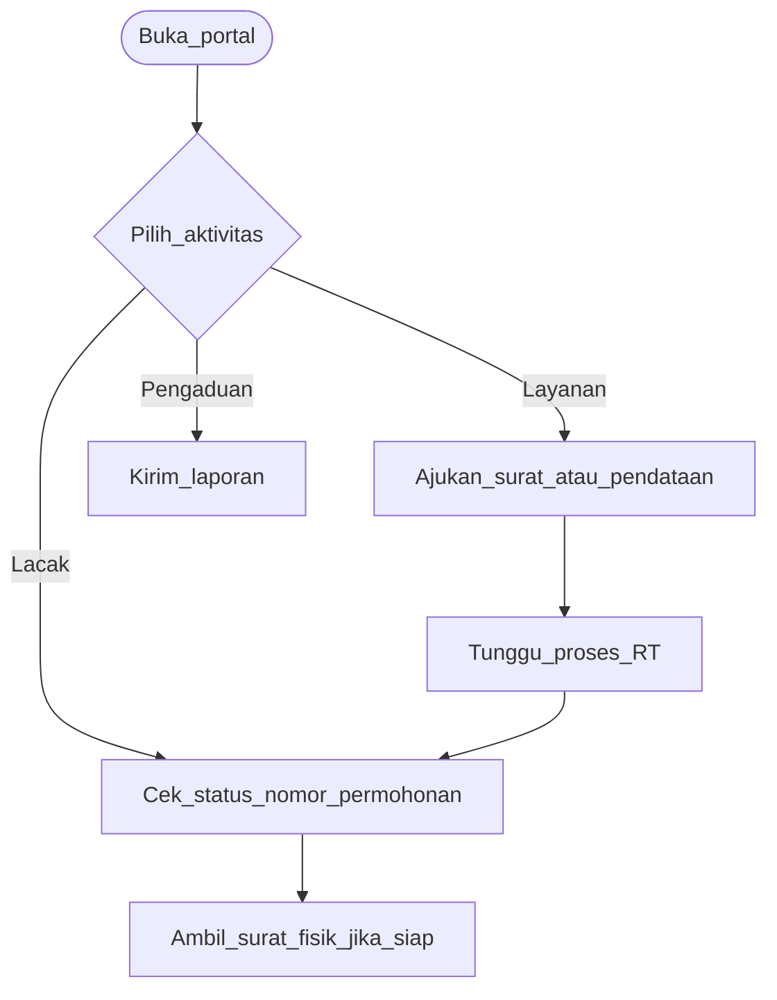

Tanpa login. Notifikasi status via WhatsApp teks.

### 3.4.2 Aktivitas Pengurus RT

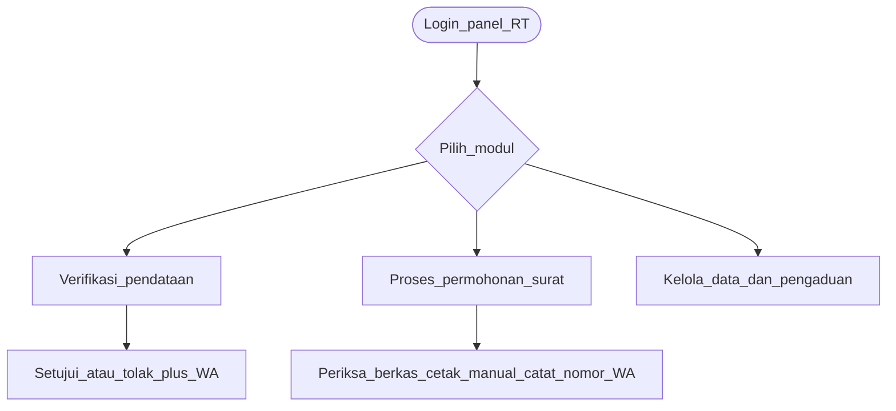

### 3.4.3 Verifikasi Wajah Pendataan Warga

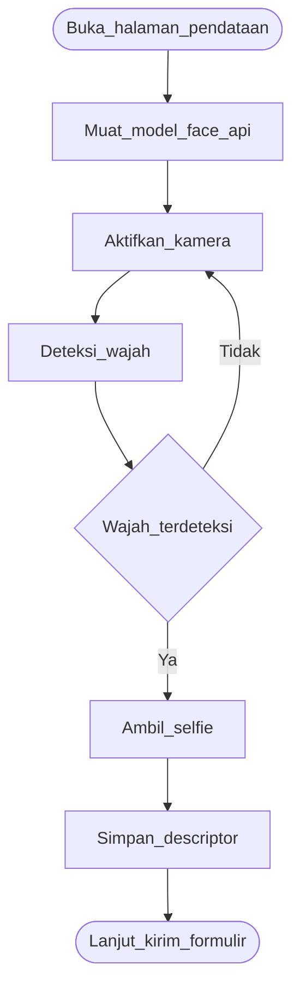

Threshold kecocokan: `FACE_MATCH_THRESHOLD` (default 0.6) di `config/kelurahan.php`.

### 3.4.4 Alur Tiga Layanan Utama

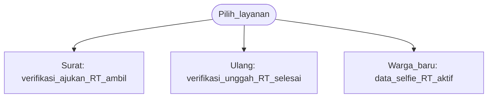

---

## 3.5 Data Flow Diagram (DFD)

### DFD Level 0 (Context Diagram)

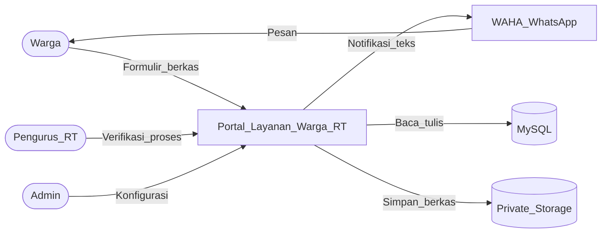

### DFD Level 1 — Proses Utama

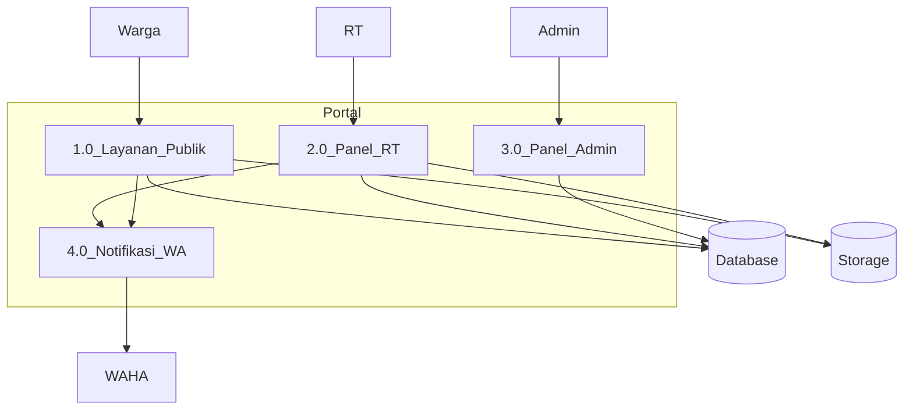

---

## 3.6 Perancangan Database

### 3.6.1 Entity Relationship Diagram (ERD)

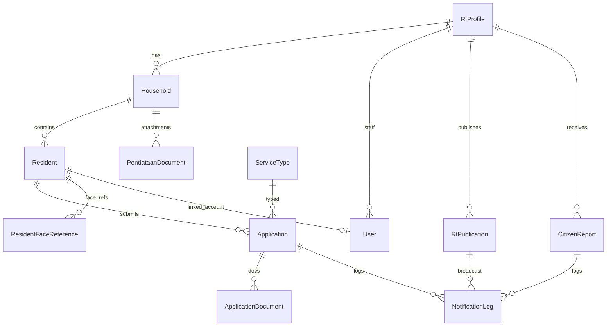

### 3.6.2 Entitas Utama

| Entitas | Deskripsi | Model |
|---|---|---|
| `RtProfile` | Profil RT (nomor, slug, alamat sekretariat, cap) | `app/Models/RtProfile.php` |
| `Household` | Kartu Keluarga per RT | `app/Models/Household.php` |
| `Resident` | Data individu warga (NIK, demografi, domisili) | `app/Models/Resident.php` |
| `Application` | Permohonan surat; nomor surat manual di `form_data.manual_letter` | `app/Models/Application.php` |
| `PendataanDocument` | Lampiran KK/KTP/KIA pendataan | `app/Models/PendataanDocument.php` |
| `ResidentFaceReference` | Descriptor wajah referensi (JSON) | `app/Models/ResidentFaceReference.php` |
| `CitizenReport` | Pengaduan/laporan warga | `app/Models/CitizenReport.php` |
| `NotificationLog` | Log notifikasi WhatsApp | `app/Models/NotificationLog.php` |
| `User` | Akun pengurus (role: ketua_rt, sekretaris_rt, super_admin) | `app/Models/User.php` |

Migrasi awal: `database/migrations/2026_05_18_000001_create_rt008_schema.php` (55 file migrasi total).

---

## 3.7 Perancangan Antarmuka

### 3.7.1 Portal Publik

Navigasi: **Beranda**, **Profil**, **Kegiatan & Pengumuman**, **Layanan**, **Pengaduan**, **Lacak Permohonan**, **Akses Pengurus**.

| Halaman | Route | Layout |
|---|---|---|
| Beranda | `/` | Hero *Layanan Administrasi RT*; keunggulan (Cepat & praktis, Transparan, Akurat & terintegrasi); FAQ |
| Layanan | `/layanan` | Tiga kartu: Surat, Pendataan ulang, Pendataan warga |
| Surat | `/layanan/surat` | Katalog 7 jenis surat + alur layanan |
| Lacak | `/lacak` | Form nomor permohonan + FAQ pelacakan |
| Keamanan | `/keamanan` | Disclaimer portal resmi, layanan gratis |

Konten beranda selaras dengan `app/Support/HomeContent.php` dan `config/kelurahan.php`.

### 3.7.2 Panel Pengurus RT

Layout: sidebar + konten (`resources/views/layouts/panel.blade.php`).

Modul sidebar: Dashboard, Verifikasi pendataan, Data warga, Permohonan surat, Laporan warga, Kegiatan, Pengumuman, Notifikasi, Profil.

### 3.7.3 Panel Admin

- **Admin** (`/admin`): manajemen pengguna, profil RT, katalog layanan, hapus permanen.

---

## 3.8 Perancangan Arsitektur

### Diagram Deployment (Produksi)

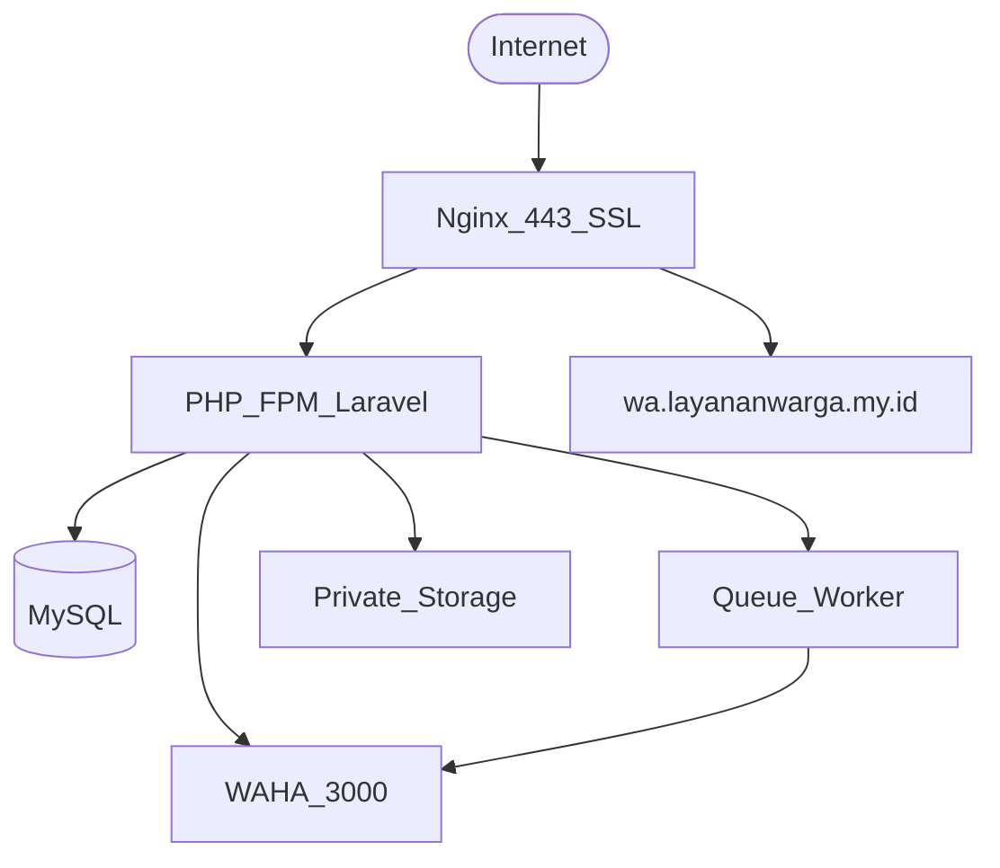

**Services Docker Compose** (`docker-compose.yml`):

| Service | Image/Build | Fungsi |
|---|---|---|
| `app` | `docker/php/Dockerfile` | PHP-FPM 8.4 + Node + ImageMagick |
| `nginx` | nginx:1.27-alpine | Reverse proxy, SSL Let's Encrypt |
| `mysql` | mysql:latest | Database `laravel` |
| `queue` | Same as app | `php artisan queue:work` |
| `waha` | devlikeapro/waha:latest | WhatsApp HTTP API |
| `waha-bootstrap` | curlimages/curl | Auto-start sesi WAHA |

Domain produksi: `https://layananwarga.my.id`

---

## 3.9 Perancangan Keamanan

| Aspek | Implementasi |
|---|---|
| **Autentikasi** | Session Laravel; login hub `/akses-pengurus` |
| **Autorisasi** | Middleware `role.rt`, `role.admin` di `bootstrap/app.php` |
| **HTTPS** | Wajib; HSTS via middleware `SecurityHeaders` |
| **CSP** | Content Security Policy pada response HTML |
| **Berkas privat** | `storage/app/private`; akses via `DocumentViewerController` (pengurus login) |
| **Rate limiting** | Endpoint publik sensitif (verifikasi identitas) |
| **Validasi input** | Form Request Laravel; NIK 16 digit; validasi MIME unggah |

Role yang boleh login via hub: Ketua RT, Sekretaris RT, Super Admin. Role Warga diarahkan ke Lacak.

---

# BAB IV — Implementasi dan Pengujian

## 4.1 Lingkungan Pengembangan

| Komponen | Spesifikasi |
|---|---|
| Bahasa backend | PHP 8.4 |
| Framework | Laravel 13.8+ |
| Database dev | SQLite (testing); MySQL (produksi) |
| Node.js | 22.x |
| Build tool | Vite 8.x |
| CSS | Tailwind CSS 4.x |
| Testing | PHPUnit 12.x |
| Container | Docker Compose |
| OS server | Linux (VPS) |

---

## 4.2 Struktur Proyek

```
layananwarga/
├── app/
│   ├── Http/Controllers/   # Public, Rt, Admin, Auth
│   ├── Models/             # 17 model Eloquent
│   ├── Services/           # WahaNotification, FaceVerification, dll.
│   ├── Jobs/               # SendWhatsAppNotification, dll.
│   └── Enums/              # UserRole, ApplicationStatus, dll.
├── resources/
│   ├── views/              # Blade templates per area
│   ├── js/                 # Modul JS (pendataan, face-api)
│   └── css/                # Tailwind app.css
├── routes/web.php          # Semua route web (~234 baris)
├── database/migrations/    # 55 migrasi
├── tests/Feature/          # 44 file test feature
├── docker/                 # Dockerfile, nginx config
└── docs/                   # Dokumentasi sistem
```

---

## 4.3 Implementasi Modul

### 4.3.1 Portal Publik

**File kunci:** `app/Http/Controllers/Public/*`

Implementasi halaman beranda, profil kelurahan/RT, katalog layanan, kegiatan & pengumuman, keamanan. Konten dinamis dari `HomeContent.php` dan `config/kelurahan.php`.

Keunggulan platform (sesuai tampilan web):
- *Cepat & praktis* — pengajuan online tanpa antre di kantor RT untuk tahap awal.
- *Transparan* — status permohonan dapat dipantau.
- *Akurat & terintegrasi* — verifikasi identitas dan data warga terpusat.

### 4.3.2 Modul Surat Pengantar RT

**File kunci:**
- `Public/LetterServiceController.php` — katalog & verifikasi identitas
- `Public/GuestApplicationController.php` — formulir permohonan
- `Services/GuestResidentService.php` — cocokkan NIK+RT+HP

**Jenis surat** (seed `ServiceCatalogSeeder`): Domisili, SKTM, SKU, Pengantar KK, Pengantar KTP, Pengantar SKCK, Surat Umum.

**Alur status:** Diajukan → (Perlu lengkap) → Siap diambil / Ditolak.

Sequence diagram:

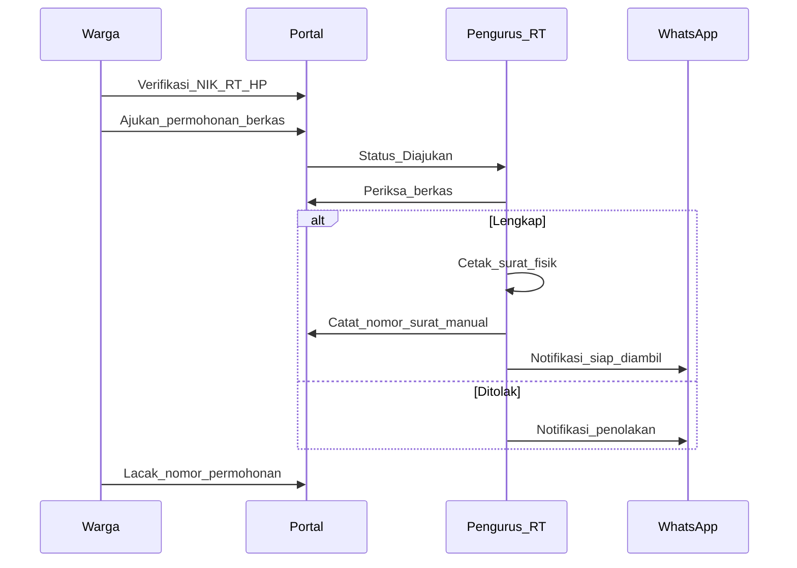

### 4.3.3 Modul Pendataan Warga

**File kunci:**
- `Public/PendataanWargaController.php` — pendaftaran keluarga baru
- `Public/PendataanUlangController.php` — pembaruan data terdaftar
- `resources/js/pendataan-warga-face.js` — verifikasi wajah browser
- `Services/FaceVerificationService.php` — pencocokan descriptor
- `Services/RtHouseholdRegistrationService.php` — proses registrasi KK

Persyaratan pendataan warga (dari `config/kelurahan.php`):
- Scan KK dan KTP/KIA setiap anggota (PDF/JPG/PNG, maks. 5 MB).
- Selfie wajah kepala keluarga via kamera.
- Bukan layanan penerbitan KK/KTP resmi.

### 4.3.4 Panel Pengurus RT

**File kunci:** `app/Http/Controllers/Rt/*`

| Modul | Controller | Fitur |
|---|---|---|
| Dashboard | `DashboardController` | Ringkasan operasional, aktivitas terbaru |
| Verifikasi pendataan | `PendataanVerificationController` | Setujui/tolak/minta lengkap |
| Data warga | `ResidentDataController`, `ResidentController`, `HouseholdController` | CRUD KK & anggota, unduh laporan PDF |
| Permohonan surat | `ApplicationController` | Review berkas, catat nomor surat, notifikasi WA |
| Pengaduan | `ContactReportController` | Kelola status laporan warga |
| Publikasi | `RtPublicationController` | CRUD kegiatan/pengumuman, broadcast WA |

### 4.3.5 Modul Notifikasi WhatsApp (WAHA)

**File kunci:**
- `Services/WahaNotificationService.php`
- `config/waha.php`, `config/kelurahan.php` (template pesan)
- `Jobs/SendWhatsAppNotification.php`, `SendPendataanWhatsApp.php`, dll.

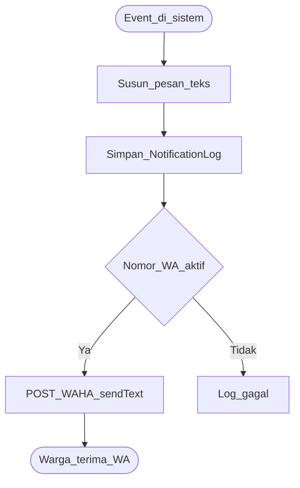

API WAHA yang dipanggil: `GET /api/sessions/{session}`, `POST /api/sendText`.

Event notifikasi: `submitted`, `verified`, `approved`, `rejected`, `letter_ready`, `pendataan_*`, `report_*`, `publication_broadcast`.

### 4.3.6 Modul Admin & Keamanan

**File kunci:**
- `Admin/UserController.php` — CRUD pengguna pengurus
- `Admin/RtProfileController.php` — profil RT
- `Admin/ServiceTypeController.php` — katalog layanan
- `Admin/PermanentDeletionRequestController.php` — approval hapus permanen
- `Http/Middleware/SecurityHeaders.php` — CSP, HSTS
- `Http/Middleware/EnsureUserIsRtStaff.php` — RBAC

---

## 4.4 Screenshot Antarmuka

*[Placeholder: sisipkan screenshot dari produksi `https://layananwarga.my.id` atau lingkungan lokal]*

| No | Halaman | Route | Keterangan |
|---|---|---|---|
| 1 | Beranda | `/` | Hero, keunggulan platform, FAQ |
| 2 | Katalog layanan | `/layanan` | Tiga layanan utama |
| 3 | Surat pengantar | `/layanan/surat` | Katalog jenis surat |
| 4 | Formulir pendataan | `/layanan/pendataan-warga` | Form KK + selfie wajah |
| 5 | Lacak permohonan | `/lacak` | Form nomor permohonan |
| 6 | Login pengurus | `/akses-pengurus` | Halaman login hub |
| 7 | Dashboard RT | `/rt` | Ringkasan operasional |
| 8 | Detail permohonan RT | `/rt/applications/{id}` | Catat nomor surat manual |
| 9 | Data warga RT | `/rt/data-warga` | Daftar KK & anggota |
| 10 | Panel admin | `/admin` | Manajemen pengguna |

---

## 4.5 Metode Pengujian

### 4.5.1 Pengujian Black-Box

Pengujian fungsional dilakukan dengan PHPUnit Feature Tests — mensimulasikan HTTP request ke route aplikasi dan memverifikasi response, database state, dan notifikasi.

Konfigurasi testing (`phpunit.xml`):
- Database: SQLite in-memory
- Queue: sync
- Environment: `testing`

### 4.5.2 Pengujian Unit

Pengujian komponen terisolasi: `FaceVerificationService`, `PhoneNormalizer`, `LetterKopFields`, `HouseholdHousingOptions`.

### 4.5.3 Evaluasi Pengguna *(opsional)*

*[Placeholder: kuesioner SUS atau wawancara pengurus RT — isi jika diwajibkan kampus]*

---

## 4.6 Hasil Pengujian

### Ringkasan Eksekusi PHPUnit

| Metrik | Nilai |
|---|---|
| **Total test** | 379 |
| **Passed** | 379 |
| **Failed** | 0 |
| **Assertions** | 2.176 |
| **Durasi** | 85,78 detik |
| **Tanggal pengujian** | Juni 2026 |
| **Perintah** | `php artisan test` |

**Kesimpulan:** Seluruh 379 test lulus tanpa kegagalan.

### Tabel Pengujian Black-Box per Fitur

| No | Fitur / Skenario | File Test | Status |
|---|---|---|---|
| 1 | Alur surat pengantar lengkap | `LayananSuratFlowTest.php` | Lulus |
| 2 | Routing layanan RT | `LayananRtRoutingTest.php` | Lulus |
| 3 | Verifikasi identitas surat | `SuratVerifyRedirectTest.php` | Lulus |
| 4 | Profil pemohon surat | `ApplicationApplicantProfileTest.php` | Lulus |
| 5 | Pendataan warga baru | `PendataanWargaTest.php` | Lulus |
| 6 | Pendataan ulang | `PendataanUlangTest.php` | Lulus |
| 7 | Field formulir KK | `PendataanHouseholdFieldsTest.php` | Lulus |
| 8 | Validasi nomor KK | `FamilyCardNumberValidationTest.php` | Lulus |
| 9 | Verifikasi pendataan RT (setujui/tolak) | `PendataanVerificationRejectTest.php` | Lulus |
| 10 | Sinkronisasi referensi wajah | `FaceReferenceSyncTest.php` | Lulus |
| 11 | Notifikasi WhatsApp permohonan | `WhatsAppNotificationTest.php` | Lulus |
| 12 | Notifikasi WhatsApp publikasi | `PublicationWhatsAppTest.php` | Lulus |
| 13 | Lacak permohonan & nomor surat manual | `TrackAndLoginHubPageTest.php` | Lulus |
| 14 | Login hub pengurus | `LoginHubValidationTest.php` | Lulus |
| 15 | Review aksi permohonan RT | `RtApplicationReviewActionsTest.php` | Lulus |
| 16 | Hapus permohonan RT | `RtApplicationDeleteTest.php` | Lulus |
| 17 | Cap/stempel RT pada permohonan | `RtApplicationStampTest.php` | Lulus |
| 18 | Index data warga RT | `RtResidentDataIndexTest.php` | Lulus |
| 19 | Hapus warga RT | `RtResidentDeletionTest.php` | Lulus |
| 20 | Dashboard analytics RT | `RtDashboardAnalyticsTest.php` | Lulus |
| 21 | Hapus laporan warga | `RtReportDeleteTest.php` | Lulus |
| 22 | Publikasi RT visibility | `RtPublicationVisibilityTest.php` | Lulus |
| 23 | Panel admin UI | `AdminPanelUiTest.php` | Lulus |
| 24 | Manajemen user admin | `AdminUserEmailTest.php` | Lulus |
| 25 | Hapus permanen (approval admin) | `PermanentDeletionRequestTest.php` | Lulus |
| 26 | Halaman publik layout | `PublicPagesLayoutTest.php` | Lulus |
| 27 | Halaman beranda | `HomePageTest.php` | Lulus |
| 28 | Persyaratan layanan | `ServiceRequirementsTest.php` | Lulus |
| 29 | Document viewer (berkas privat) | `DocumentViewerTest.php` | Lulus |
| 30 | Verifikasi wajah (unit) | `FaceVerificationServiceTest.php` | Lulus |
| 31 | Normalisasi nomor HP (unit) | `PhoneNormalizerTest.php` | Lulus |

Log lengkap: lihat [Lampiran G](#lampiran-g-log-hasil-php-artisan-test).

---

# BAB V — Penutup

## 5.1 Kesimpulan

Berdasarkan perancangan, implementasi, dan pengujian Portal Layanan Warga RT, dapat disimpulkan:

1. **Tujuan umum tercapai** — portal layanan administrasi RT berbasis web telah dibangun dan di-deploy di `https://layananwarga.my.id` untuk Kelurahan Inauga, Kabupaten Mimika.

2. **Modul layanan utama berfungsi** — permohonan surat pengantar (7 jenis), pendataan warga baru, pendataan ulang, pelacakan status, dan pengaduan masyarakat dapat diakses warga tanpa login.

3. **Verifikasi identitas terimplementasi** — surat pengantar menggunakan verifikasi NIK + RT + nomor HP; pendataan warga baru menggunakan verifikasi wajah selfie berbasis face-api.js di browser.

4. **Panel operasional RT lengkap** — pengurus RT dapat memverifikasi pendataan, memproses permohonan surat dengan pencatatan nomor surat manual, mengelola data warga, menangani pengaduan, dan mempublikasikan kegiatan.

5. **Notifikasi WhatsApp otomatis** — integrasi WAHA mengirim pesan teks pada perubahan status permohonan, pendataan, pengaduan, dan publikasi.

6. **Pengujian sistematis** — 379 test PHPUnit (2.176 assertions) seluruhnya lulus, memvalidasi alur bisnis utama.

### Kontribusi / Keunggulan Sistem

1. **Integrasi layanan RT end-to-end** — pendataan hingga pemrosesan surat pengantar dalam satu portal.
2. **Verifikasi identitas terarah** — NIK/RT/HP untuk surat; verifikasi wajah AI untuk pendataan baru.
3. **Akses warga tanpa registrasi** — cukup verifikasi identitas saat mengajukan; lacak via nomor permohonan.
4. **Notifikasi teks WhatsApp otomatis** — tanpa pengiriman berkas PDF.
5. **Panel operasional RT terpusat** — data warga, permohonan, publikasi dalam satu antarmuka.
6. **Keamanan berkas dan keaslian situs** — dokumen privat; halaman `/keamanan` menegaskan portal resmi gratis.
7. **Deploy containerized** — replikasi mudah via Docker Compose.

---

## 5.2 Saran

1. **Integrasi SIAK/Dukcapil** — sinkronisasi data kependudukan resmi apabila API tersedia di tingkat kabupaten.
2. **Aplikasi mobile** — Progressive Web App (PWA) atau aplikasi native untuk aksesibilitas warga di perangkat mobile.
3. **Evaluasi pengguna** — kuesioner System Usability Scale (SUS) kepada warga dan pengurus RT pasca implementasi.
4. **OTP verifikasi HP** — lapisan keamanan tambahan pada verifikasi identitas surat pengantar.
5. **Backup & disaster recovery** — prosedur backup otomatis database dan berkas privat.
6. **Pelatihan pengurus RT** — sosialisasi penggunaan panel operasional di seluruh RT Kelurahan Inauga.

---

# Lampiran

## Lampiran A — Use Case & Activity Diagram Lengkap

Diagram use case (§3.2), activity warga (§3.4.1), activity RT (§3.4.2), verifikasi wajah (§3.4.3), alur layanan (§3.4.4), dan sequence surat (§4.3.2) dapat diekspor ke PNG via [Mermaid Live Editor](https://mermaid.live) atau ekstensi VS Code.

---

## Lampiran B — Dictionary Data

### Tabel `rt_profiles`

| Kolom | Tipe | Keterangan |
|---|---|---|
| id | bigint PK | — |
| rt_number | varchar(10) | Nomor RT |
| rw_number | varchar(10) | Nomor RW |
| kelurahan, kecamatan, kota, provinsi | varchar | Wilayah |
| ketua_rt, sekretaris_rt | varchar | Nama pengurus |
| alamat_kantor | text | Alamat sekretariat |
| slug | varchar | URL profil publik |
| stamp_path | varchar | Path cap/stempel RT |

### Tabel `households`

| Kolom | Tipe | Keterangan |
|---|---|---|
| id | bigint PK | — |
| rt_profile_id | FK | RT domisili |
| family_card_number | varchar(32) unique | Nomor KK |
| address | text | Alamat tempat tinggal |
| status | varchar | aktif / nonaktif |

### Tabel `residents`

| Kolom | Tipe | Keterangan |
|---|---|---|
| id | bigint PK | — |
| household_id | FK | KK induk |
| nik | varchar(16) unique | NIK |
| name | varchar | Nama lengkap |
| birth_place, birth_date | — | Tempat/tanggal lahir |
| gender, religion, occupation | varchar | Demografi |
| domicile_status | varchar | aktif / pindah / meninggal |
| phone | varchar(20) | HP/WhatsApp |
| is_head_of_family | boolean | Kepala keluarga |

### Tabel `applications`

| Kolom | Tipe | Keterangan |
|---|---|---|
| id | bigint PK | — |
| application_number | varchar unique | Nomor permohonan |
| service_type_id | FK | Jenis surat |
| resident_id | FK | Pemohon |
| status | varchar | draft, diajukan, siap_diambil, ditolak, dll. |
| form_data | json | Data formulir incl. `manual_letter` |
| purpose | text | Keperluan surat |

### Tabel `citizen_reports`

| Kolom | Tipe | Keterangan |
|---|---|---|
| id | bigint PK | — |
| report_number | varchar unique | Format LPR{RT}-{YYYYMM}{seq} |
| rt_profile_id | FK | RT tujuan |
| category | varchar | Jenis pengaduan |
| status | varchar | baru, ditindak, selesai |

### Tabel `notification_logs`

| Kolom | Tipe | Keterangan |
|---|---|---|
| id | bigint PK | — |
| phone | varchar(20) | Nomor tujuan |
| event | varchar | Jenis event |
| message | text | Isi pesan |
| status | varchar | pending, sent, failed |
| sent_at | timestamp | Waktu terkirim |

*(Tabel lengkap 17 entitas: lihat migrasi di `database/migrations/`)*

---

## Lampiran C — Screenshot Halaman

*[Placeholder: lampirkan screenshot produksi — beranda, layanan, panel RT, lacak, login hub, admin]*

---

## Lampiran D — Tabel Pengujian Black-Box Lengkap

Lihat Tabel 4.6 di BAB IV §4.6. Total 44 file Feature Test + 5 file Unit Test = 49 file test, 379 method test.

---

## Lampiran E — Template Pesan WhatsApp

Sumber: `config/kelurahan.php`

### Permohonan Surat (`wa_permohonan`)

| Event | Template (ringkas) |
|---|---|
| submitted | Permohonan {layanan} ({no}) di {rt} *diterima* — menunggu verifikasi RT |
| verified | Permohonan *diterima* pengurus RT — sedang disusun |
| approved | Surat *siap* — lacak nomor surat di /lacak |
| rejected | Permohonan *ditolak* — {catatan} |

### Pendataan (`wa_pendataan`)

| Event | Template (ringkas) |
|---|---|
| submitted | Data pendaftaran diterima — *menunggu verifikasi* |
| verified | Pendaftaran *diverifikasi* — sudah terdata sebagai warga {rt} |
| rejected | Pengajuan *ditolak* — {catatan} |

### Laporan (`wa_laporan`)

| Event | Template (ringkas) |
|---|---|
| submitted | Laporan {no} ke {rt} *diterima* — perihal: {perihal} |
| status_updated | Laporan {no} status: *{status}* — {catatan} |

### Publikasi (`wa_publikasi`)

| Event | Template (ringkas) |
|---|---|
| kegiatan | {rt} mengumumkan kegiatan: {judul} — {tanggal}, {lokasi} |
| pengumuman | {rt} — Pengumuman: {judul} |

---

## Lampiran F — Manual Pengguna Singkat

### F.1 Panduan Warga

1. **Mengajukan surat pengantar**
   - Buka `layananwarga.my.id` → menu **Layanan** → **Surat pengantar RT**.
   - Pilih jenis surat → baca persyaratan → klik **Ajukan**.
   - Verifikasi identitas: masukkan NIK (16 digit), pilih RT, nomor HP terdaftar.
   - Isi keperluan, unggah KK/KTP → kirim.
   - Catat **nomor permohonan** yang ditampilkan.

2. **Melacak permohonan**
   - Menu **Lacak Permohonan** → masukkan nomor permohonan.
   - Status *Siap diambil* menampilkan nomor surat — ambil surat fisik di sekretariat RT.

3. **Pendataan warga baru**
   - Menu **Layanan** → **Pendataan warga**.
   - Isi data KK & anggota, unggah scan KK/KTP, ambil selfie wajah kepala keluarga.
   - Tunggu verifikasi pengurus RT (notifikasi WhatsApp).

4. **Pengaduan**
   - Menu **Pengaduan** → pilih RT & jenis masalah → isi formulir → kirim.

> Portal **gratis**. Bukan layanan Dukcapil. Tidak diminta pembayaran atau OTP bank.

### F.2 Panduan Pengurus RT

1. **Login:** `layananwarga.my.id/akses-pengurus` — akun Ketua RT atau Sekretaris RT.
2. **Verifikasi pendataan:** Panel → Verifikasi pendataan → periksa berkas → Setujui/Tolak.
3. **Proses surat:** Panel → Permohonan surat → buka detail → periksa berkas → cetak surat fisik di sekretariat → catat nomor surat → kirim notifikasi WhatsApp.
4. **Data warga:** Panel → Data warga → cari/tambah KK & anggota → unduh laporan PDF jika perlu.
5. **Pengaduan:** Panel → Laporan warga → update status → notifikasi otomatis ke pelapor.

---

## Lampiran G — Log Hasil `php artisan test`

```
Tests:    379 passed (2176 assertions)
Duration: 85.78s
```

**Environment:** PHPUnit 12, Laravel testing, SQLite in-memory, queue sync.

**Test suites:**
- `Tests\Feature` — 44 file (pengujian HTTP, alur bisnis, UI assertion)
- `Tests\Unit` — 5 file (FaceVerification, PhoneNormalizer, LetterKop, dll.)

**Cara reproduksi:**

```bash
# Via Docker (produksi)
docker compose exec app php artisan test

# Atau lokal (jika PHP terinstal)
php artisan test
```

Seluruh test **PASS** — tidak ada kegagalan pada tanggal pengujian Juni 2026.

---

## Daftar Pustaka

1. Heeks, R. (2006). *Implementing and Managing eGovernment*. Sage Publications.
2. Laudon, K. C., & Laudon, J. P. (2020). *Management Information Systems*. Pearson.
3. Republik Indonesia. (2006). *Undang-Undang No. 23 Tahun 2006 tentang Administrasi Kependudukan*.
4. Republik Indonesia. (2019). *Peraturan Pemerintah No. 40 Tahun 2019*.
5. Kemendagri. (2019). *Permendagri No. 95 Tahun 2019 tentang Standar Teknis SIAK*.
6. Laravel LLC. (2026). *Laravel 13 Documentation*. https://laravel.com/docs
7. WAHA. *WhatsApp HTTP API Documentation*. https://waha.devlike.pro
8. vlada2901. *face-api.js*. https://github.com/vladmandic/face-api

---

## Dokumen Terkait

- [`RINGKASAN-SISTEM.md`](RINGKASAN-SISTEM.md) — ringkasan teknis singkat
- [`REFERENSI.md`](REFERENSI.md) — referensi hukum & benchmark
- [`DEPLOY.md`](DEPLOY.md) — prosedur deploy produksi
- [`sop-arsip-warga-rt.md`](sop-arsip-warga-rt.md) — SOP arsip warga RT

---

*Akhir dokumen — Portal Layanan Warga RT · Kelurahan Inauga · Kabupaten Mimika · https://layananwarga.my.id*
