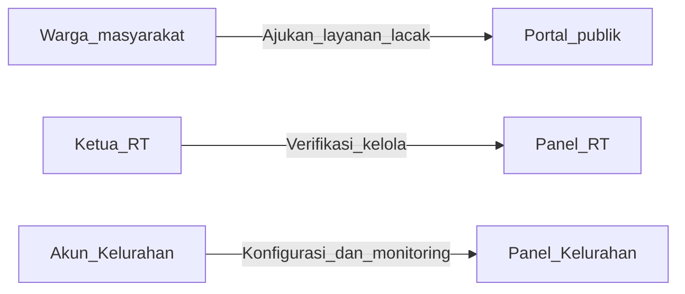
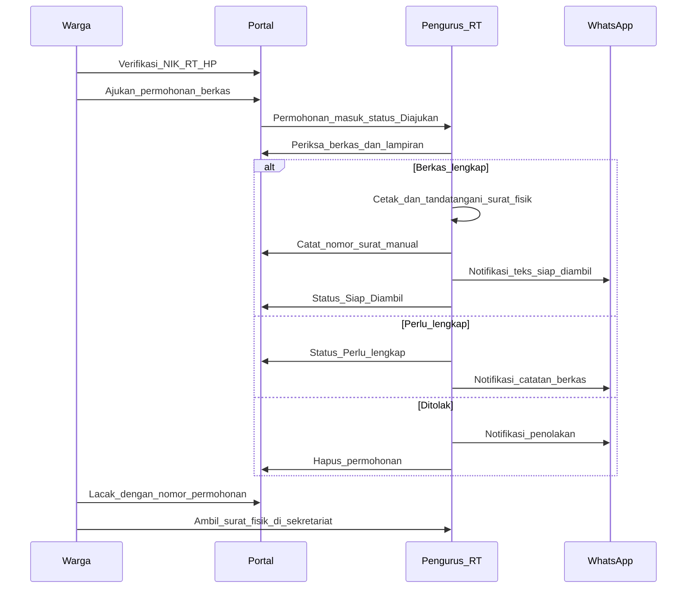
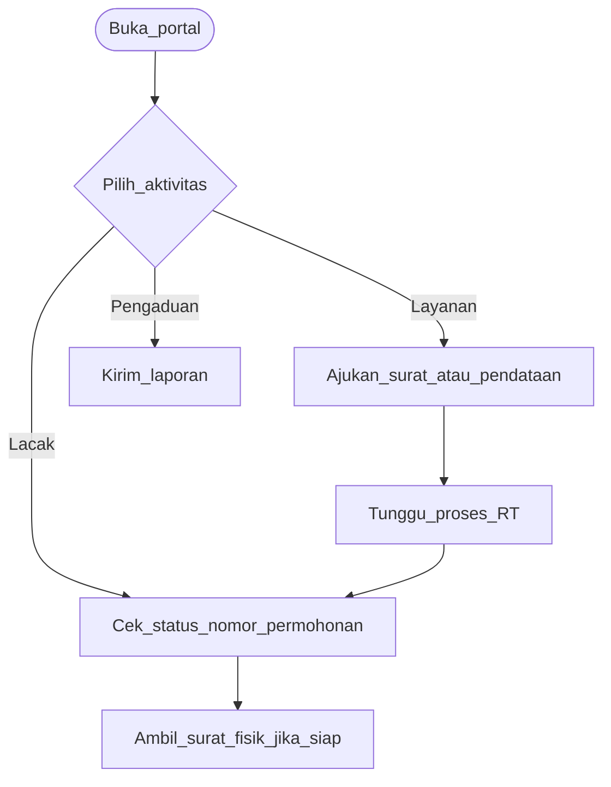
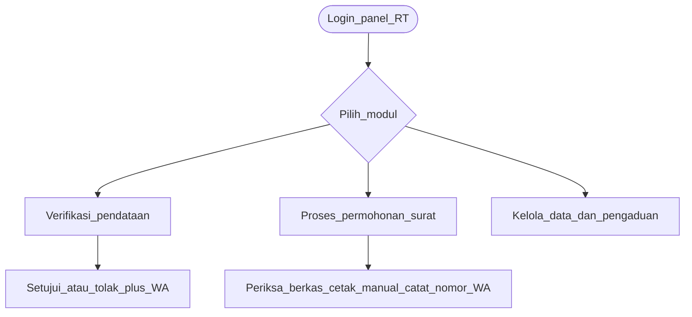
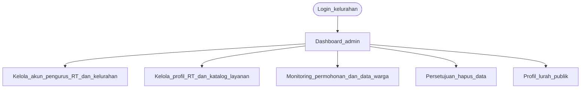
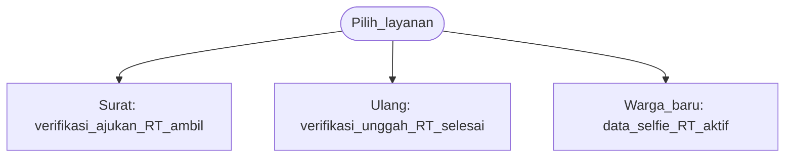
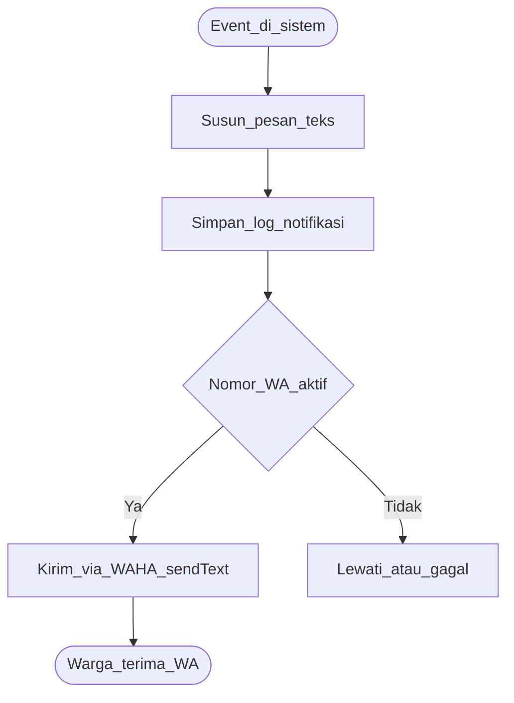

# Ringkasan Sistem — Portal Layanan Warga RT (layananwarga.my.id)

Dokumen ini siap disalin/diadaptasi ke BAB I–III tugas akhir. Sesuaikan judul resmi, nama penulis, dan referensi metodologi dengan naskah Anda.

---

## 1. Identitas Sistem

| Aspek | Keterangan |
|---|---|
| **Nama sistem** | Portal Layanan Warga RT (Layanan Warga RT) |
| **Nama tampilan web** | Layanan Administrasi RT |
| **Tagline / subtitle** | Di Kelurahan Inauga · Kabupaten Mimika |
| **URL produksi** | https://layananwarga.my.id |
| **Wilayah layanan** | Kelurahan Inauga, Distrik Wania, Kabupaten Mimika, Papua Tengah |
| **Jenis sistem** | Portal layanan administrasi RT berbasis web (information system + e-government tingkat RT) |
| **Bukan bagian dari** | Dukcapil, Kemendagri, bank, atau layanan pembayaran — portal ini **bukan** penerbit KK/KTP/SKTM resmi |
| **Biaya layanan** | Gratis untuk warga; tidak meminta kartu kredit, PIN bank, OTP pembayaran, atau transfer uang |

---

## 2. Latar Belakang dan Permasalahan

Administrasi di tingkat RT masih banyak dilakukan secara manual: warga datang ke sekretariat untuk mengajukan surat pengantar, menyerahkan fotokopi KK/KTP, dan menunggu informasi status permohonan. Proses pendataan warga baru atau pembaruan data keluarga sering terpisah dari arsip digital, sehingga pengurus RT kesulitan melacak kelengkapan berkas dan histori permohonan.

Permasalahan yang ditangani sistem ini:

- Antrean dan ketergantungan tatap muka untuk layanan surat pengantar RT
- Data warga tersebar (form fisik, chat WhatsApp, arsip berkas)
- Warga tidak punya cara praktis memantau status permohonan
- Verifikasi identitas pemohon surat masih rentan kesalahan data
- Pengurus RT membutuhkan panel terpusat untuk pendataan, permohonan, dan publikasi kegiatan

---

## 3. Tujuan Sistem

1. **Digitalisasi layanan administrasi RT** — warga mengajukan permohonan surat pengantar, pendataan, dan pengaduan secara online tanpa login
2. **Manajemen data kependudukan tingkat RT** — pencatatan Kartu Keluarga (KK), anggota keluarga, dan lampiran dokumen identitas
3. **Verifikasi identitas terarah** — surat pengantar: cocokkan NIK, RT, dan nomor HP terdaftar; pendataan warga: tambahan verifikasi wajah selfie kepala keluarga di browser
4. **Pemrosesan surat manual di RT** — pengurus RT memverifikasi berkas, mencetak surat fisik di sekretariat, lalu mencatat nomor surat di portal
5. **Transparansi status layanan** — warga melacak permohonan tanpa login melalui **nomor permohonan** (halaman Lacak)
6. **Notifikasi real-time** — pembaruan status dikirim sebagai pesan teks via WhatsApp (WAHA), bukan pengiriman berkas PDF
7. **Publikasi informasi** — kegiatan dan pengumuman RT dapat diakses publik di satu halaman
8. **Panel kelurahan** — manajemen akun pengurus, konfigurasi RT & layanan, monitoring wilayah, dan profil lurah publik

---

## 4. Ruang Lingkup

### Dalam lingkup

- Portal publik untuk warga (tanpa akun wajib): beranda, layanan, profil, pengaduan, lacak, kegiatan & pengumuman, keamanan
- Halaman **Keamanan** (`/keamanan`) — keaslian situs, panduan akses pengurus, penegasan layanan gratis
- Halaman **Akses Pengurus** (`/akses-pengurus`) — login Ketua RT atau Kelurahan
- Panel pengurus RT (Ketua RT)
- Panel Kelurahan (manajemen akun pengurus RT & kelurahan, profil RT, katalog layanan, monitoring wilayah, profil lurah)
- Penyimpanan berkas privat (KK, KTP, dokumen permohonan)
- Pencatatan nomor surat manual dan notifikasi pengambilan surat fisik
- Verifikasi wajah berbasis browser (face-api.js / TensorFlow.js) pada **pendataan warga**
- Integrasi WhatsApp (WAHA): notifikasi teks (status permohonan, surat siap diambil + nomor surat) — bukan pengiriman berkas PDF

### Di luar lingkup

- Penerbitan dokumen kependudukan resmi (KK, KTP, Akta)
- Generasi atau unduhan surat PDF oleh portal (surat dicetak manual di sekretariat RT)
- Pengiriman berkas surat PDF via WhatsApp
- Integrasi langsung ke database Dukcapil/SIAK
- Pembayaran online, OTP pembayaran, atau transaksi finansial

---

## 5. Aktor Pengguna

| Aktor | Peran | Akses |
|---|---|---|
| **Warga** | Mengajukan pendataan, surat, pengaduan; melacak status | Portal publik (tanpa login untuk sebagian besar layanan) |
| **Ketua RT** | Verifikasi pendataan, proses permohonan, catat nomor surat manual, kelola data warga | Panel `/rt` |
| **Kelurahan** | Manajemen akun pengurus RT & kelurahan, profil RT, katalog layanan, monitoring wilayah, profil lurah | Panel `/kelurahan` |

---

## 6. Fitur Utama

### 6.1 Portal Publik (Warga)

Navigasi utama: **Beranda**, **Profil**, **Kegiatan & Pengumuman**, **Layanan**, **Pengaduan**, **Lacak Permohonan**, **Akses Pengurus**.

| Halaman / fitur | Deskripsi (sesuai tampilan web) |
|---|---|
| **Beranda** (`/`) | Hero *Layanan Administrasi RT*; bagian *Mengenal Platform* (portal terbuka tanpa login); tiga keunggulan (Cepat & praktis, Transparan, Akurat & terintegrasi); enam kartu fitur utama; FAQ *Panduan Penggunaan Layanan*; catatan notifikasi WhatsApp teks (bukan pengiriman PDF) |
| **Profil** (`/profil`) | Profil lurah, visi-misi kelurahan, daftar RT beserta pengurus, informasi wilayah |
| **Layanan** (`/layanan`) | Tiga layanan utama: Surat pengantar RT, Pendataan ulang, Pendataan warga; tab *Alur layanan* per jenis |
| **Surat pengantar RT** (`/layanan/surat`) | Katalog jenis surat: Domisili, SKTM (tidak mampu), Usaha (SKU), Pengantar KK, Pengantar KTP, Pengantar SKCK, Umum — verifikasi identitas (NIK, RT, nomor HP), formulir permohonan, unggah KK/KTP; **tanpa** verifikasi wajah di formulir publik |
| **Pendataan warga** (`/layanan/pendataan-warga`) | Keluarga belum terdata: isi data KK, unggah KTP/KIA anggota, verifikasi wajah selfie kepala keluarga, pilih RT domisili |
| **Pendataan ulang** (`/layanan/pendataan-ulang`) | Warga terdata: verifikasi NIK kepala KK + RT + HP, unggah ulang scan KK dan KTP/KIA tiap anggota |
| **Pengaduan** (`/kontak`) | Formulir pengaduan lingkungan dan laporan/kendala layanan (bukan layanan terpisah di hub layanan) |
| **Lacak permohonan** (`/lacak`) | Cek status surat pengantar dengan **nomor permohonan**; tampil nomor surat saat siap diambil; FAQ pelacakan |
| **Kegiatan & Pengumuman** (`/kegiatan`) | Informasi kegiatan dan pengumuman RT dalam satu halaman |
| **Keamanan** (`/keamanan`) | Portal resmi layananwarga.my.id; bukan Dukcapil/bank; layanan gratis; login pengurus hanya di `/akses-pengurus` |
| **Akses Pengurus** (`/akses-pengurus`) | Halaman login pengurus RT dan kelurahan (warga tidak perlu akun untuk layanan utama) |

### 6.2 Panel Pengurus RT

| Modul | Fungsi |
|---|---|
| **Dashboard** | Ringkasan operasional RT |
| **Verifikasi pendataan** | Setujui / tolak / minta lengkapi pengajuan pendataan warga |
| **Data warga** | Daftar KK dan anggota, pencarian, detail profil, tambah anggota, unduh laporan RT (PDF) |
| **Permohonan surat** | Periksa berkas; minta lengkapi berkas; tolak permohonan (hapus data + notifikasi WA); **catat nomor surat manual** dan kirim notifikasi teks WhatsApp dari halaman detail permohonan; kirim ulang notifikasi jika perlu |
| **Laporan pengaduan** | Kelola laporan warga, update status, balas via WhatsApp (teks) |
| **Kegiatan & Pengumuman** | CRUD publikasi, broadcast WhatsApp (teks) |
| **Profil RT** | Kelola data sekretariat dan pengurus |

> **Catatan operasional:** Alur susun/terbitkan surat PDF via portal tidak dipakai. Route compose/publish PDF di kode masih ada tetapi di-redirect ke detail permohonan dengan pesan informasi; standar operasional adalah cetak manual di sekretariat RT lalu pencatatan nomor surat di panel.

### 6.3 Panel Kelurahan

- Manajemen akun pengurus (Ketua RT, Kelurahan)
- Manajemen profil RT (nomor RT, slug, wilayah)
- Konfigurasi katalog jenis layanan surat
- Persetujuan penghapusan permanen data warga
- Monitoring permohonan, data warga, kegiatan, dan laporan seluruh RT (mode baca)
- Profil lurah publik di halaman `/profil`

---

## 7. Alur Bisnis Utama

### 7.1 Alur Permohonan Surat Pengantar

Status operasional di UI: **Diajukan → (Perlu lengkap) → Siap diambil** atau **Ditolak** (permohonan dihapus). Status *Verifikasi RT* dan *Disetujui* masih ada di enum/timeline untuk kompatibilitas data lama, tetapi jalur utama panel RT adalah periksa berkas lalu catat nomor surat manual.

Portal **tidak** menghasilkan atau mencetak surat. Surat dicetak dan ditandatangani manual di sekretariat RT; sistem hanya mencatat nomor surat (`form_data.manual_letter`) dan mengirim notifikasi teks agar warga mengambil dokumen fisik.

### 7.2 Alur Pendataan Warga

1. Warga mengisi formulir data KK dan anggota keluarga
2. Unggah scan KK dan KTP/KIA tiap anggota
3. Verifikasi wajah kepala keluarga (selfie via kamera)
4. Pengurus RT memeriksa berkas di panel verifikasi
5. Jika disetujui, data masuk ke database warga RT dan status domisili aktif

### 7.3 Verifikasi Wajah dan Identitas

**Surat pengantar (portal publik):** verifikasi identitas dengan NIK 16 digit, pilihan RT, dan nomor HP/WhatsApp yang cocok dengan data terdaftar — tanpa selfie di formulir ajukan surat saat ini.

**Pendataan warga:** sistem memanfaatkan **face-api.js** (TensorFlow.js) di browser:

- Selfie kepala keluarga wajib sebagai bukti kehadiran pemohon saat pendaftaran keluarga baru
- Model dimuat di halaman pendataan warga; warga mengambil foto langsung dari kamera perangkat

**Panel RT (referensi wajah):**

- Ekstraksi descriptor wajah dari scan KTP/KK dapat dilakukan server-side (Node.js + ImageMagick) saat pengurus mengelola dokumen warga
- Infrastruktur `ResidentFaceReference` mendukung kesiapan data wajah di panel, terpisah dari alur ajukan surat publik

---

## 8. Arsitektur Teknologi

### Stack Backend

- **Framework**: Laravel 13 (PHP 8.4)
- **Database**: MySQL
- **Queue**: Laravel Queue Worker (notifikasi asinkron)

Surat pengantar dicetak manual di sekretariat RT, bukan dihasilkan oleh sistem web.

### Stack Frontend

- **Template**: Blade (server-side rendering)
- **Build tool**: Vite 8 + Laravel Vite Plugin
- **CSS**: Tailwind CSS 4
- **JavaScript**: Vanilla JS modular (form pendataan, verifikasi wajah, tabel data warga)

### Infrastruktur (Production)

- **Containerization**: Docker Compose
  - `app` — PHP-FPM 8.4
  - `nginx` — reverse proxy + SSL (Let's Encrypt)
  - `mysql` — database
  - `queue` — worker antrian
  - `waha` — WhatsApp HTTP API
- **Domain**: layananwarga.my.id (HTTPS)
- **Penyimpanan berkas**: `storage/app/private` (tidak publik)

### Integrasi Eksternal

| Layanan | Fungsi |
|---|---|
| **WAHA** | Kirim notifikasi teks (status permohonan, surat siap diambil + nomor surat) ke WhatsApp warga |
| **face-api / TensorFlow.js** | Deteksi dan verifikasi wajah di browser (pendataan warga) |
| **ImageMagick** | Konversi PDF ke gambar untuk ekstraksi wajah |

### Keamanan

- HTTPS wajib (HSTS)
- Content Security Policy (CSP)
- Berkas sensitif disimpan di disk privat, diakses hanya pengurus login
- Middleware role-based access (`role.rt`, `role.kelurahan`, `role.admin`)
- Rate limiting pada endpoint publik sensitif
- Header anti-cache untuk halaman HTML dinamis

---

## 9. Model Data Utama

| Entitas | Deskripsi |
|---|---|
| `RtProfile` | Profil RT (nomor, slug, alamat sekretariat) |
| `Household` | Kartu Keluarga (No. KK, RT, alamat) |
| `Resident` | Data individu warga (NIK, nama, demografi, status domisili) |
| `PendataanDocument` | Lampiran KK/KTP/KIA pendataan |
| `ResidentFaceReference` | Descriptor wajah referensi dari dokumen identitas |
| `Application` | Permohonan layanan (surat) dengan nomor unik; nomor surat manual disimpan di `form_data.manual_letter` |
| `ApplicationDocument` | Lampiran permohonan surat |
| `GeneratedLetter` | Arsip legacy surat PDF lama (bukan alur standar operasional saat ini) |
| `ServiceType` | Katalog jenis layanan surat |
| `CitizenReport` | Laporan/pengaduan warga |
| `RtPublication` | Kegiatan dan pengumuman |
| `NotificationLog` | Log notifikasi WhatsApp |
| `User` | Akun pengurus (`ketua_rt`, `kelurahan`) |

---

## 10. Kontribusi / Keunggulan Sistem

Untuk bagian **hasil/kontribusi** tugas akhir, poin-poin berikut dapat digunakan:

1. **Integrasi layanan RT end-to-end** — dari pendataan warga hingga pemrosesan permohonan surat pengantar (online → verifikasi RT → pengambilan fisik) dalam satu portal
2. **Verifikasi identitas terarah** — surat: NIK + RT + nomor HP terdaftar; pendataan warga: tambahan verifikasi wajah berbasis AI di browser tanpa plugin khusus
3. **Akses warga tanpa registrasi** — warga tidak perlu membuat akun; cukup verifikasi identitas saat mengajukan dan lacak via nomor permohonan
4. **Notifikasi teks WhatsApp otomatis** — pembaruan status dan pemberitahuan surat siap diambil beserta nomor surat, tanpa pengiriman berkas PDF
5. **Panel operasional RT dan kelurahan** — manajemen data warga & permohonan di panel RT; konfigurasi sistem dan monitoring wilayah di panel kelurahan
6. **Keamanan berkas dan keaslian situs** — dokumen identitas disimpan privat; halaman keamanan dan disclaimer menegaskan portal resmi yang gratis
7. **Deploy containerized** — mudah di-replicate di lingkungan RT/Kelurahan lain dengan Docker

---

## 11. Contoh Paragraf Siap Pakai (BAB I)

> **Latar Belakang.** Administrasi di tingkat Rukun Tetangga (RT) Kelurahan Inauga, Kabupaten Mimika, masih banyak mengandalkan proses manual untuk pelayanan surat pengantar, pendataan warga, dan penanganan pengaduan masyarakat. Keterbatasan tersebut menimbulkan antrean, keterlambatan informasi status permohonan, serta kesulitan pengurus RT dalam mengelola arsip data kependudukan secara terpusat. Oleh karena itu, penelitian ini mengembangkan *Portal Layanan Warga RT* — sistem informasi berbasis web yang memfasilitasi pengajuan layanan administrasi RT secara daring, verifikasi identitas warga, manajemen data kependudukan tingkat RT, serta notifikasi status layanan melalui WhatsApp.

> **Rumusan Masalah.** Bagaimana merancang dan mengimplementasikan portal layanan administrasi RT berbasis web yang mampu (1) memfasilitasi pengajuan dan pelacakan permohonan surat pengantar, (2) mengelola pendataan warga beserta lampiran dokumen identitas, (3) melakukan verifikasi identitas pemohon, dan (4) mendukung pengurus RT dalam memproses permohonan secara efisien?

> **Tujuan.** (1) Membangun portal layanan warga RT yang dapat diakses melalui web browser. (2) Mengimplementasikan modul pendataan warga, permohonan surat pengantar, pelacakan status, dan pengaduan masyarakat. (3) Mengintegrasikan verifikasi identitas (NIK/RT/HP untuk surat; verifikasi wajah untuk pendataan warga) serta notifikasi teks WhatsApp pada alur layanan. (4) Menyediakan panel pengurus RT dan panel kelurahan untuk verifikasi, pencatatan surat manual, konfigurasi layanan, dan monitoring wilayah.

> **Batasan.** Sistem ini **bukan** layanan resmi Dukcapil dan **tidak** menerbitkan KK, KTP, atau SKTM resmi. Sistem **tidak** menghasilkan surat PDF — surat dicetak manual di sekretariat RT. Layanan portal **gratis** untuk warga dan tidak meminta pembayaran, transfer, OTP pembayaran, kartu kredit, atau PIN bank. Sistem difokuskan pada layanan administrasi tingkat RT di Kelurahan Inauga, Kabupaten Mimika, Papua Tengah.

---

## 12. Catatan untuk Revisi

- Ganti "penelitian ini" / "sistem ini" sesuai gaya penulisan naskah Anda
- Tambahkan diagram use case / ERD dari model data di [`app/Models/`](../app/Models/) jika diminta penguji
- Cantumkan URL demo: https://layananwarga.my.id
- Jika BAB metodologi meminta justifikasi teknologi: Laravel dipilih karena MVC mature, ekosistem PHP luas di pemerintahan daerah, dan Docker memudahkan deployment di server VPS
- Selaraskan deskripsi surat dan WhatsApp dengan kebijakan fase 1 di [REFERENSI.md](REFERENSI.md): WAHA hanya notifikasi teks, surat fisik dicetak di RT
- **Sinkronkan teks dengan tampilan web** — sumber konten publik utama:
  - [`app/Support/HomeContent.php`](../app/Support/HomeContent.php) — beranda, alur layanan, FAQ
  - [`config/kelurahan.php`](../config/kelurahan.php) — branding, persyaratan layanan, template WA, FAQ lacak
  - [`resources/views/layouts/partials/navbar.blade.php`](../resources/views/layouts/partials/navbar.blade.php) — menu navigasi
- **Diagram alur siap pakai** — lihat §13 di bawah; ekspor ke PNG (Mermaid Live / VS Code) untuk lampiran TA
- **Diagram tambahan yang disarankan penguji:** Use Case (4 aktor), ERD (`app/Models/`), diagram deployment Docker, DFD level 0–1, activity diagram verifikasi wajah (pendataan warga), tabel event WAHA, screenshot UI, tabel pengujian black-box

---

## 13. Diagram Alur (Flowchart)

Diagram disederhanakan untuk naskah TA. Detail langkah per layanan ada di §7 dan §6.1. Diagram dapat diekspor ke PNG (Mermaid Live / VS Code).

### 13.1 Aktivitas Warga

Tanpa login. Notifikasi status via WhatsApp teks (bukan PDF).

### 13.2 Aktivitas Pengurus RT

Surat dicetak di sekretariat RT; portal mencatat nomor dan kirim notifikasi teks.

### 13.3 Aktivitas Kelurahan

### 13.4 Alur Layanan (tiga layanan utama)

**Surat:** wajib sudah terdata. **Pendataan ulang:** warga terdata. **Pendataan warga:** keluarga baru + selfie kepala KK.

### 13.5 Integrasi WhatsApp Gateway (WAHA)

Hanya pesan teks (`/api/sendText`), bukan PDF. Beberapa event diproses via queue worker. Template di [`config/kelurahan.php`](../config/kelurahan.php).

### 13.6 Saran diagram tambahan untuk naskah TA

| Prioritas | Diagram / materi | Kegunaan di naskah |
|---|---|---|
| Tinggi | Use Case Diagram (3 aktor: Warga, RT, Kelurahan) | BAB analisis kebutuhan |
| Tinggi | ERD dari model di `app/Models/` | BAB desain database |
| Tinggi | Diagram deployment (Docker: nginx, app, mysql, queue, waha) | BAB implementasi & infrastruktur |
| Sedang | DFD Level 0 & 1 (portal, panel, WAHA, storage) | BAB analisis sistem |
| Sedang | Activity diagram verifikasi wajah (pendataan warga) | BAB fitur khusus |
| Sedang | Sequence diagram login pengurus (`/akses-pengurus`) | BAB keamanan akses |
| Sedang | Tabel event WAHA (event → trigger → template config) | Lampiran teknis |
| Rendah | Screenshot halaman (beranda, layanan, panel RT) | BAB implementasi UI |
| Rendah | Tabel pengujian black-box per fitur | BAB pengujian |
| Rendah | Kuesioner SUS / wawancara pengurus RT | BAB evaluasi |
| Rendah | Tabel perbandingan benchmark (lihat [REFERENSI.md](REFERENSI.md)) | BAB latar belakang |

**Tips penyajian:** Di naskah utama cukup 2–3 diagram representatif (misalnya §13.1 Warga, §13.4 Layanan, §13.5 WAHA); sisanya sebagai lampiran.

---

## Dokumen terkait

- [LAPORAN-TUGAS-AKHIR.md](LAPORAN-TUGAS-AKHIR.md) — naskah tugas akhir lengkap BAB I–V + lampiran
- [DEPLOY.md](DEPLOY.md) — prosedur deploy dan operasional server
- [REFERENSI.md](REFERENSI.md) — referensi hukum dan benchmark layanan serupa
